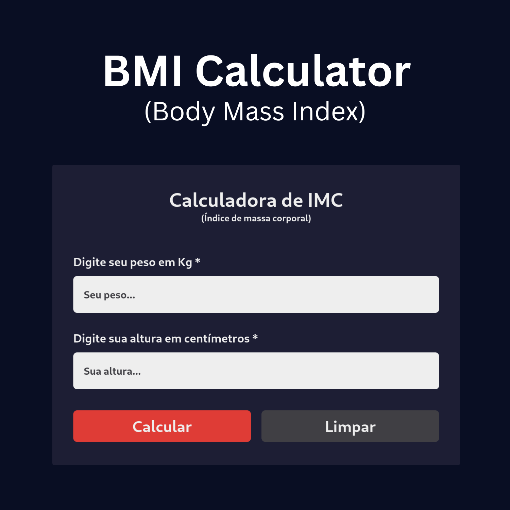

<h1 align="center"> BMI Calculator </h1>

  <a href="#-technologies">Technologies</a>&nbsp;&nbsp;&nbsp;|&nbsp;&nbsp;&nbsp;
  <a href="#-project">Project</a>&nbsp;&nbsp;&nbsp;|&nbsp;&nbsp;&nbsp;
  <a href="#memo-license">License</a>

  

 

  

## 🚀 Technologies

This project was developed with the following technologies:

- HTML and CSS
- JavaScript
- Git and GitHub
- Tailwind CSS
- React

## 💻 Project

The BMI Calculator is a project that calculates a person's body mass index.

## :memo: License

This project is under the GPL-3.0 license. Veja o arquivo [LICENSE](LICENSE.md) para mais detalhes.
